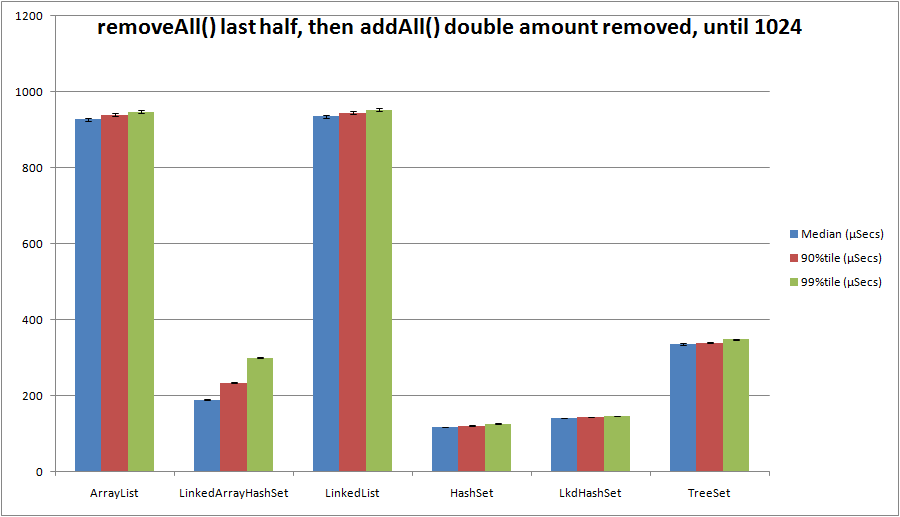
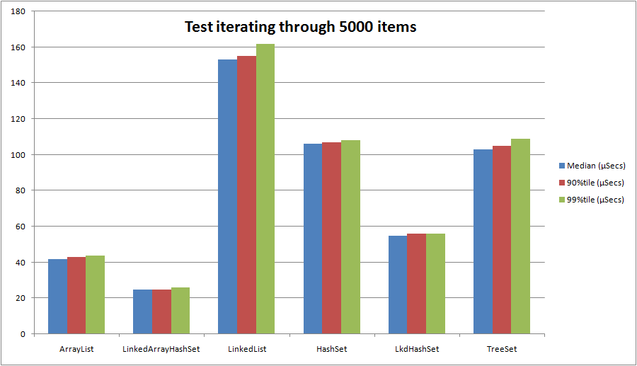
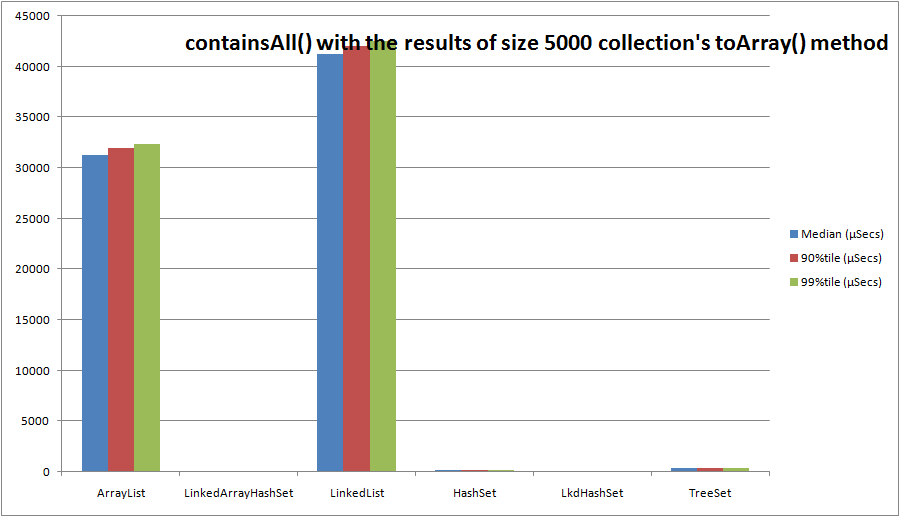
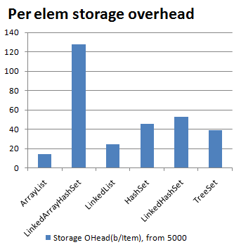

Combinations or extensions of java collections.

 - The java.util List and Set interfaces:
   - Using an indexed unrolled linked list (LinkedArrayHashSet)
   - (TODO) Using element hashcodes directly (ArraySet)
 - (TODO) A java.util List with CAS operations (fine grained locking on unrolled linked list) (ConcurrentLinkedList)
 - (TODO) A BigInteger sized list (list that can explicitly hold more than 2^31 items) (BigList)
 - (TODO) An ArrayList<Short> that uses short[] as an internal array (CompactPrimitiveArrayList)

The following microbenchmarks (from PerformanceTest.java with JDK6-x64 on an i7-3770 with 16GB RAM) are
included to illustrate cases where a LinkedArrayHashSet may be useful:

